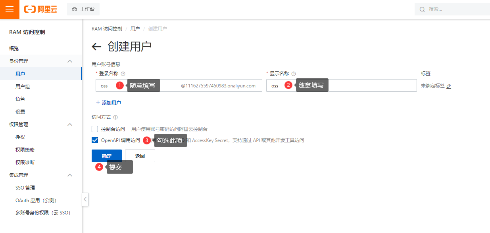
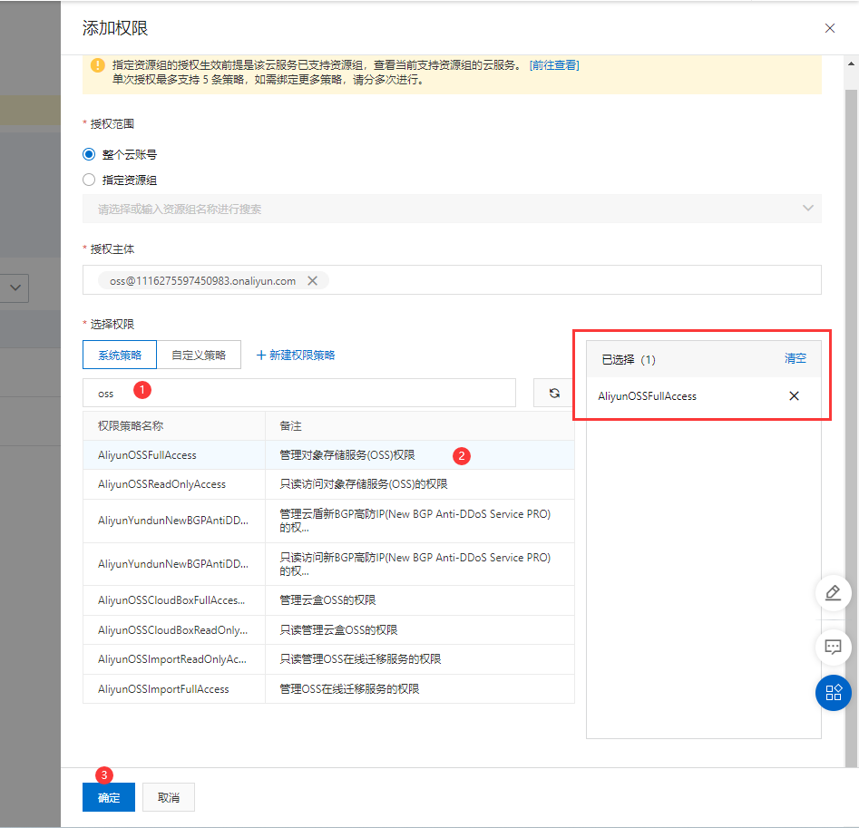

# OSS阿里云对象存储-示例

本仓库目的是方便新手入门，内含示例。更多信息详见 [官方文档](https://help.aliyun.com/document_detail/32067.html)

> **Note**
> 运行代码须知：请将 `.env.example` 重命名为 `.env` 并填写完整

## 准备

> 阿里云：阿里云账号AccessKey拥有所有API的访问权限，风险很高。强烈建议您创建并使用RAM用户进行API访问或日常运维，请登录RAM控制台创建RAM用户。

### 创建RAM用户

访问 https://ram.console.aliyun.com/users/create 创建用户，勾选 `OpenAPI 调用访问`

> 注意：Key只会显示一次，请及时复制~



### 授予权限

访问 https://ram.console.aliyun.com/users 对刚刚创建的用户添加权限

在系统策略中选择 `AliyunOSSFullAccess - 管理对象存储服务(OSS)权限`



## 面向官方的教程

### 1. 安装

`pnpm add ali-oss`

### 2. 初始化

``` js
let OSS = require('ali-oss');

let client = new OSS({
  // yourRegion填写Bucket所在地域。以华东1（杭州）为例，Region填写为oss-cn-hangzhou。
  region: 'yourRegion',
  // 阿里云账号AccessKey拥有所有API的访问权限，风险很高。强烈建议您创建并使用RAM用户进行API访问或日常运维，请登录RAM控制台创建RAM用户。
  accessKeyId: 'yourAccessKeyId',
  accessKeySecret: 'yourAccessKeySecret',
  
});
```

## url签名示例+有效期

示例文件
``` shell
node utils/signatureUrl
```

url时效签名能防止用户对一个链接狂刷流量的行为，失效后无法访问，需要访问源站再次生成签名的url，源站就可以对频率进行限制。

代码
``` js
const url = client.signatureUrl("文件路径",{
  expires: 60 // 设置过期时间，默认值为1800秒。
});
```

示例
``` js
const url = client.signatureUrl("test.txt",{
  expires: 30 // 过期时间30秒
});
```

## Star 历史

[](https://star-history.com/#YuzeTT/ali-oss-example&Date)